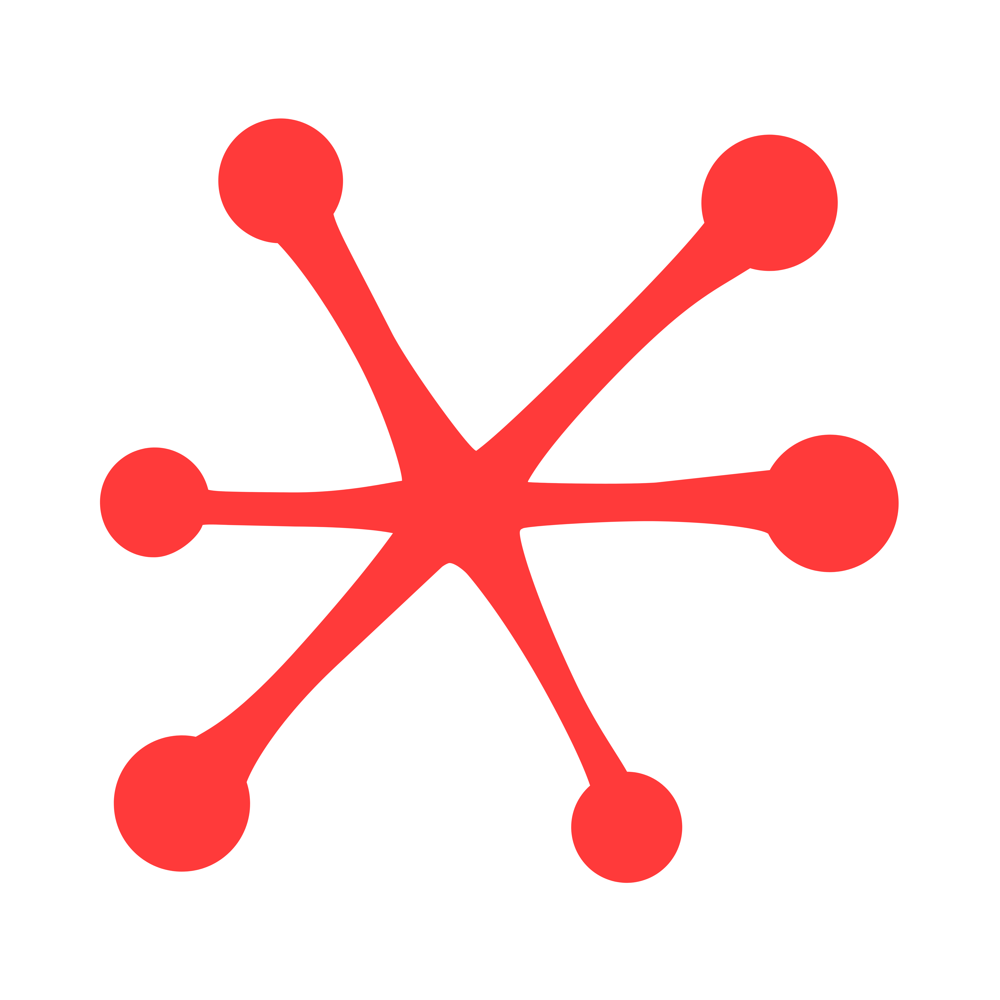

<p align="center">
  
</p>

<h1 align="center">supernerve</h1>

<p align="center">
  <strong>The Enterprise Nervous System</strong><br/>
  Where software stops being a tool — and starts thinking for itself.
</p>

<p align="center">
  <a href="https://supernerve.monodox.com/docs/intro">Documentation</a> •
  <a href="https://supernerve.monodox.com/docs/getting-started/quickstart">Quickstart</a> •
  <a href="ROADMAP.md">Roadmap</a> •
  <a href="CONTRIBUTING.md">Contributing</a>
</p>

---

## What is supernerve?

Enterprise software was never designed to think. It was designed to wait — for clicks, for commands, for someone to tell it what to do next.

**supernerve changes that.**

supernerve is an AI-driven platform that unifies knowledge, workflows, and execution into a self-optimizing ecosystem. Every tool, interface, and process dynamically adapts to user needs and business goals. Autonomous agents reconfigure workflows, personalize interfaces, and execute tasks in real time — transforming static enterprise software into a living, evolving system that learns, acts, and optimizes itself.

## The Vision

Imagine an enterprise where:

- 🧠 **Knowledge flows like thought** — information finds the people who need it before they ask
- ⚡ **Workflows rewire themselves** — processes adapt to context, not the other way around
- 🤖 **Agents act autonomously** — routine decisions happen without human bottlenecks
- 🔄 **Systems evolve continuously** — the platform learns from every interaction and improves

This isn't automation. This is **enterprise intelligence**.

## Core Architecture

```
┌─────────────────────────────────────────────────────┐
│                   supernerve core                     │
├──────────┬──────────┬──────────┬───────────────────┤
│  Agents  │  Skills  │Connectors│    Workflows       │
│          │          │          │                     │
│ Memory   │Summarize │ Slack    │ Triggers → Steps   │
│ Research │ Extract  │ Notion   │ Conditions         │
│ Task     │ Classify │ GitHub   │ Parallel Execution │
│ Workflow │ Generate │ GDrive   │ Self-Optimization  │
│ Interface│ Search   │  ...     │                     │
└──────────┴──────────┴──────────┴───────────────────┘
```

## Quick Start

```bash
npm install @supernerve/sdk
```

```typescript
import { Agent } from '@supernerve/sdk';

const nerve = new Agent({
  name: 'first-nerve',
  skills: ['summarize', 'classify', 'search'],
  connectors: ['slack', 'notion'],
  memory: true,
});

// It doesn't just respond. It understands, remembers, and acts.
const insight = await nerve.run('Analyze team velocity and suggest workflow improvements');
```

## Documentation

This repository contains the supernerve documentation site, built with [Docusaurus](https://docusaurus.io/).

### Local Development

```bash
npm install
npm start
```

### Build

```bash
npm run build
```

## License

This project is licensed under the Apache License 2.0 — see [LICENSE](LICENSE) for details.

## Contributing

We welcome contributions. See [CONTRIBUTING.md](CONTRIBUTING.md) for guidelines.

## Security

To report vulnerabilities, see [SECURITY.md](SECURITY.md).

---

<p align="center">
  <em>Static software is dead. Long live the nervous system.</em>
</p>
